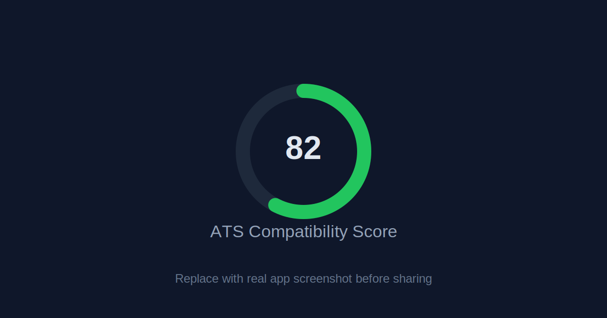
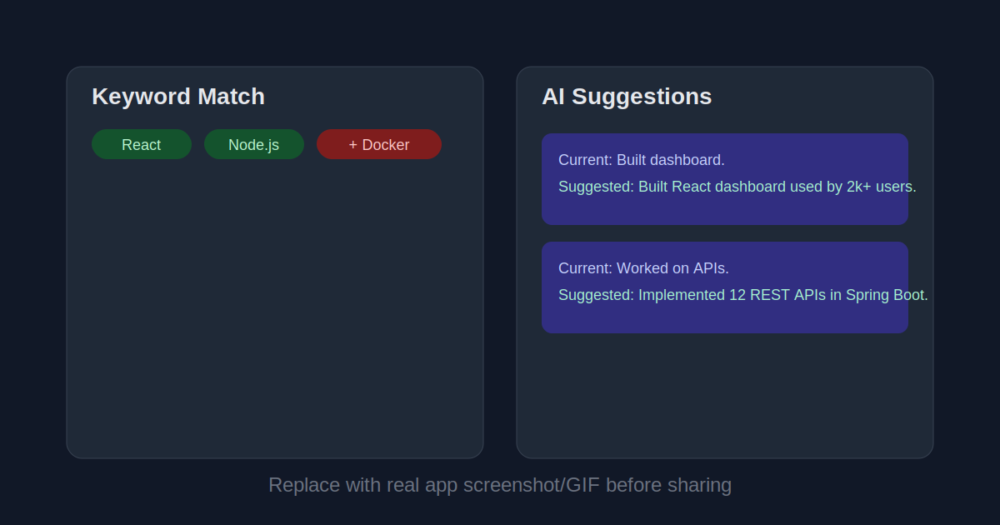

# Resume_Checker

> AI-powered ATS resume analysis platform that scores resumes, highlights keyword gaps, and generates rewrite suggestions.

🔗 **Live Demo:** https://resume-checker-alpha-two.vercel.app





## Features
- 0-100 ATS compatibility score with animated circular meter
- Keyword match highlighting against job description
- Section-wise breakdown (Keywords, Skills, Experience, Formatting, Contact)
- JWT auth (register/login) and history dashboard (last 10 checks)
- Gemini-powered AI rewrite suggestions with retry fallback
- Downloadable PDF ATS report (jsPDF + html2canvas)
- Rate limiting on analyze endpoint (10 requests/hour/IP)

## Tech Stack
- React
- Spring Boot (Java 17)
- MongoDB
- Google Gemini API
- Vercel (frontend deployment)

## What I Built / Learned
I designed Resume_Checker as an end-to-end ATS workflow instead of a single upload demo.  
The backend combines deterministic scoring logic with Gemini suggestions, so users get both a numeric signal and actionable rewrites.  
I implemented JWT-based auth and history tracking to make resume iterations measurable over time.  
I also improved production-readiness with file-size/type validation, API error boundaries, and request rate limiting.

## API Overview
Base URL: `/api`

Auth:
- `POST /api/auth/register`
- `POST /api/auth/login`

Resume:
- `POST /api/resume/analyze` (multipart: `file`, optional `jobDescription`, optional `jobTitle`)
- `POST /api/resume/generate-ats`
- `POST /api/resume/suggestions`

History (JWT required):
- `GET /api/history`
- `DELETE /api/history/{id}`

## Run Locally

1. Clone and install frontend dependencies:
```bash
cd frontend/React
npm install
```

2. Create env files:
- `frontend/.env.example` -> copy to `frontend/React/.env` and set:
```bash
VITE_API_URL=http://localhost:8080
```
- `backend/.env.example` -> copy to your backend env setup and set:
```bash
MONGO_URI=
JWT_SECRET=
JWT_EXPIRY_DAYS=7
GEMINI_API_KEY=
```

3. Run backend:
```bash
cd "backend/Spring Boot"
mvn spring-boot:run
```

4. Run frontend:
```bash
cd frontend/React
npm run dev
```

Frontend runs at `http://localhost:5173`.

## Notes
- `backend/Node` exists in repo history, but the active API for v2.0 is Spring Boot.
- Add actual screenshots/GIFs to `docs/screenshots/` before recruiter sharing.
